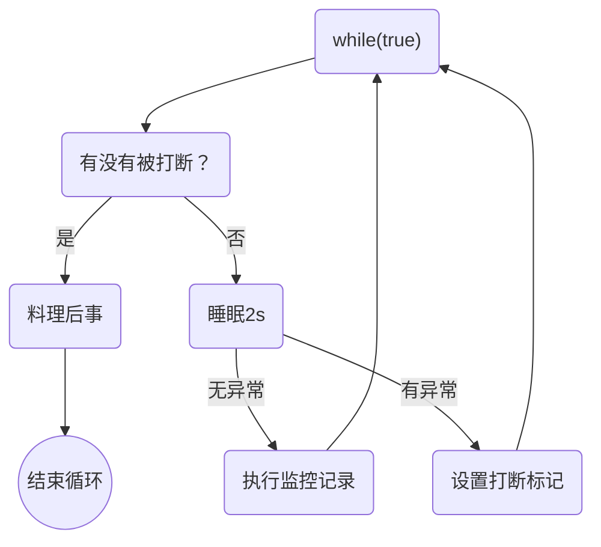

[TOC]

# 进程和线程

## 本章内容

- 进程和线程的概念
- 并行和并发的概念
- 线程的基本应用


## 进程与线程

### 进程

- 程序有指令和数据组成，但是这些指令要运行，数据要读写，就必须将指令加载到CPU，数据加载到内存。在指令运行过程中还需要用到磁盘，网络等设备；**进程就是用来加载指令，管理内存，管理IO的。**
- 当一个程序被运行，从磁盘加载这个程序的代码至内存，这时就开启了一个进程。
- 进程就可以视为程序的一个实例。大部分程序可以同时运行多个实例进程（例如记事本、画图、浏览器 等），也有的程序只能启动一个实例进程（例如网易云音乐、360 安全卫士等）


### 线程

- 一个进程之内可以分为一到多个线程。 
- 一个线程就是一个指令流，将指令流中的一条条指令以一定的顺序交给 CPU 执行
-  Java 中，线程作为最小调度单位，进程作为资源分配的最小单位。 在 windows 中进程是不活动的，只是作 为线程的容器


### 二者对比

- 进程基本上相互独立的，而线程存在于进程内，是进程的一个子集 
- 进程拥有共享的资源，如内存空间等，供其内部的线程共享 
- 进程间通信较为复杂 
  - 同一台计算机的进程通信称为 IPC（Inter-process communication） 
  - 不同计算机之间的进程通信，需要通过网络，并遵守共同的协议，例如 HTTP 
- 线程通信相对简单，因为它们共享进程内的内存，一个例子是多个线程可以访问同一个共享变量 
- 线程更轻量，线程上下文切换成本一般上要比进程上下文切换低


## 并行与并发

单核 cpu 下，线程实际还是 串行执行 的。操作系统中有一个组件叫做任务调度器，将 cpu 的时间片（windows 下时间片最小约为 15 毫秒）分给不同的程序使用，只是由于 cpu 在线程间（时间片很短）的切换非常快，人类感 觉是 同时运行的 。总结为一句话就是： **微观串行**，**宏观并行** 

一般会将这种 线程轮流使用 CPU 的做法称为并发， `concurrent`


多核 cpu下，每个 核（core） 都可以调度运行线程，这时候线程可以是并行的。


引用Rob Pike的一句话：

- 并发（concurrent）是同一时间应对（dealing with）多件事情的能力
- 并行（parallel）是同一时间动手做多件事情的能力

例子：

- 家庭主妇做饭、打扫卫生、给孩子喂奶，她一个人轮流交替做这多件事，这时就是并发
- 家庭主妇雇了个保姆，她们一起这些事，这时既有并发，也有并行（这时会产生竞争，例如锅只有一口，一 个人用锅时，另一个人就得等待）
- 雇了3个保姆，一个专做饭、一个专打扫卫生、一个专喂奶，互不干扰，这时是并行

> Rob Pike资料
>
> - golang语言的创造者
> - [Rob Pike - 百度百科](https://baike.baidu.com/item/%E7%BD%97%E5%B8%83%C2%B7%E6%B4%BE%E5%85%8B/10983505)


## 应用

### 应用之异步调用（案例1）

以调用方角度来讲，如果

- 需要等待结果返回，才能继续运行就是同步
- 不需要等待结果返回，就能继续运行就是异步

**1）设计**

多线程可以让方法执行变为异步的（即不要巴巴干等着）比如说读取磁盘文件时，假设读取操作花费了 5 秒钟，如 果没有线程调度机制，这 5 秒 cpu 什么都做不了，其它代码都得暂停...

**2）结论**

- 比如在项目中，视频文件需要转换格式等操作比较费时，这时开一个新线程处理视频转换，避免阻塞主线程 
- tomcat 的异步 servlet 也是类似的目的，让用户线程处理耗时较长的操作，避免阻塞 tomcat 的工作线程 
- ui 程序中，开线程进行其他操作，避免阻塞 ui 线程


### 应用之提高效率（案例1）

充分利用多核 cpu 的优势，提高运行效率。想象下面的场景，执行 3 个计算，最后将计算结果汇总。

```java
计算 1 花费 10 ms
计算 2 花费 11 ms
计算 3 花费 9 ms
汇总需要 1 ms
```

- 如果是串行执行，那么总共花费的时间是 10 + 11 + 9 + 1 = 31ms 
- 但如果是四核 cpu，各个核心分别使用线程 1 执行计算 1，线程 2 执行计算 2，线程 3 执行计算 3，那么 3 个 线程是并行的，花费时间只取决于最长的那个线程运行的时间，即 11ms 最后加上汇总时间只会花费 12ms

> **注意：**
>
> 需要在多核CPU才能够提高效率，单核CPU还是轮流执行


**结论：**

1、单核CPU下，多线程并不能提高程序运行效率，只是为了能够在不同的任务之间切换，不同线程轮流使用CPU，不至于一个线程总是占用CPU，别的线程没法干活

2、多核cpu可以并行跑多个线程，但是能否提高程序的运行效率还是要分情况

- 有些任务经过精心设计，将任务拆分并行执行，当然可以提高程序的运行效率。但不是所有的计算任务都可以拆分（参考后文的阿达姆定律）
- 也不是所有的任务都需要拆分，任务的目的如果不同，谈拆分和效率是没有意义的

3、IO操作不占用CPU，只是我们一般拷贝文件使用的是【阻塞IO】，这是相当于线程虽然不用cpu，但需要一直等待IO结束，没能充分利用线程。所以才用后面的【非阻塞IO】和【异步IO】优化

> 注意：
>
> IO操作会占用一定量的CPU资源，但是它们通常不会像计算密集型任务那样大量占用CPU资源。当执行IO操作时，CPU通常需要等待IO操作完成才能继续执行后续的任务。这个过程中，CPU的使用率可能会下降，因为它在等待IO操作完成。
>
> 非常频繁的IO操作还是非常浪费CPU时间的，所以面对大量的IO任务时，有时候需要算法来合并IO，或者通过cache来缓解IO压力。


# Java线程

## 本章内容

- 创建和运行线程
- 查看线程
- 线程API
- 线程状态


## 创建和运行线程

### 方法一：直接使用Thread

```java
// 创建线程对象
Thread t = new Thread() {
 public void run() {
 // 要执行的任务
 }
};
// 启动线程
t.start();
```

例如：

```java
// 构造方法的参数是给线程指定名字，推荐
Thread t1 = new Thread("t1") {
 @Override
 // run 方法内实现了要执行的任务
 public void run() {
 log.debug("hello");
 }
};
t1.start();
```

输出：

```java
19:19:00 [t1] c.ThreadStarter - hello
```

代码精简：

```java
Thread t2 = new Thread(()->{
    log.debug("nihc");
});
t2.start();
```


### 方法二：使用Runnable配合Thread

把【线程】和【任务：要执行的代码】分开：

- Thrad代表线程
- Runnable可运行的任务（线程要执行的代码）

```java
Runnable runnable = new Runnable() {
 public void run(){
 // 要执行的任务
 }
};
// 创建线程对象
Thread t = new Thread( runnable );
// 启动线程
t.start(); 
```

例如：

```java
Runnable runnable = new Runnable() {
    @Override
    public void run() {
        //                System.out.println("hello.");
        log.debug("hello.");
    }
};
Thread t1 = new Thread(runnable, "t1");
t1.start();
```

输出：

```java
19:19:00 [t1] c.ThreadStarter - hello
```

Java 8 以后可以使用lambda精简代码：

```java
Runnable t3 = ()->log.debug("她"); // Runnable t3 = ()->{log.debug("她"); 多行语句};
Thread t4 = new Thread(t3, "t4");
t4.start();
```

由于Runnable的接口上有一个注解：`@FunctionalInterface`，并且接口中只有一个抽象方法，那么就说明此方法可以进行函数式编程。如果有多个抽象方法方法那么就不能进行函数式编程。

`Runnable.java`：

```java
@FunctionalInterface
public interface Runnable {
    /**
     * When an object implementing interface {@code Runnable} is used
     * to create a thread, starting the thread causes the object's
     * {@code run} method to be called in that separately executing
     * thread.
     * <p>
     * The general contract of the method {@code run} is that it may
     * take any action whatsoever.
     *
     * @see     java.lang.Thread#run()
     */
    public abstract void run();
}
```


### 原理之Thread与Runnable的关系

分析Thread的源码，理清它与Runnable的关系：

Thread实现了Runnable接口：

```java
public class Thread implements Runnable {
```

不管是Thread的方式还是Runnable的方式，它们的底层使用的都是Thread中的`run`方法：该target就是runnable，如果runnable中有实现方法不为空，那么就调用runnable中的方法：

```java
// Thread中的run方法
@Override
public void run() {
    if (target != null) {
        target.run();
    }
}
```

**小结：**

- 使用方法1是把线程和任务和并在了一起，方法2是把线程和任务分开了
- 用Runnable更容易与线程池等高级API配合
- 用Runnable任务类脱离了Thread继承体系，更灵活


### 方法三：FutureTask配合Thread

FutureTask能够接收Callable类型的参数，用来处理有返回结果的情况：

我们可以发现：`FutureTask`类实现了接口`RunnableFuture<V>`的方法，而`RunnableFuture<V>`接口继承了`Runnable`，`Future<V>`这两个接口：

`FutureTask.java`:

```java
public class FutureTask<V> implements RunnableFuture<V> {
```

`RunnableFuture.java`：

```java
public interface RunnableFuture<V> extends Runnable, Future<V> {
    /**
     * Sets this Future to the result of its computation
     * unless it has been cancelled.
     */
    void run();
}
```

`Future.java`:

```java
public interface Future<V> {
```

我们可以发现`FutureTask`g构造函数里可以传入Callable参数：

```java
public FutureTask(Callable<V> callable) {
    if (callable == null)
        throw new NullPointerException();
    this.callable = callable;
    this.state = NEW;       // ensure visibility of callable
}
```

那么我们来看看Callable是什么？

```java
@FunctionalInterface
public interface Callable<V> {
    /**
     * Computes a result, or throws an exception if unable to do so.
     *
     * @return computed result
     * @throws Exception if unable to compute a result
     */
    V call() throws Exception;
}
```

我们发现Callable也是一个可以实现函数式编程的接口且只有一个方法。

实例：

```java
@Slf4j
public class CallableTest01 {
    public static void main(String[] args) throws ExecutionException, InterruptedException {
        // 创建任务对象
        FutureTask<Integer> task = new FutureTask(new Callable() {
            @Override
            public Object call() throws Exception {
                log.debug("running......");
                Thread.sleep(1000);
                return 100;
            }
        });
        // 参数1：任务对象   参数2：线程名，推荐
        new Thread(task, "t3").start();

        // 主线程阻塞，同步等待task执行完毕的结果
        Integer result = task.get();
        log.debug("结果是：{}", result);
    }
}
```

我们发现Thread是可以接收FutureTask对象，但是我们并没有看到Thread关于FutureTask的构造方法。那是因为FutureTask对象实现了RunnableFuture接口，而RunnableFuture接口继承了Runnable接口。因此可以使用Thread构造方法进行线程创建。


## 查看进程的方法

windows：

- 任务管理器可以查看进程和线程数，也可以杀死进程
- `tasklist`查看进程
- `taskkill`杀死进程


linux：

- `ps -fe`查看所有进程
- ps -fT -p <PID> 查看某个进程（PID）的所有线程
- `kill`杀死进程
- `top`按大写H切换是否显示线程
- `top -H -p <PID>`查看某个进程（PID）的所有线程


java：

- `jps`命令查看所有的java进程
- `jstack <PID>`查看某个Java进程（PID）的所有线程状态信息
- `jconsole`来查看某个Java进程中的线程的运行情况（图形界面）


jconsole远程监控配置：

- 需要以如下方式运行你的Java类：

  ```java
  java -Djava.rmi.server.hostname=`ip地址` -Dcom.sun.management.jmxremote -
  Dcom.sun.management.jmxremote.port=`连接端口` -Dcom.sun.management.jmxremote.ssl=是否安全连接 -
  Dcom.sun.management.jmxremote.authenticate=是否认证 java类
  
  实例：
  java -Djava.rmi.server.hostname=192.168.152.130 -Dcom.sun.management.jmxremote -
  Dcom.sun.management.jmxremote.port=12345 -Dcom.sun.management.jmxremote.ssl=false -
  Dcom.sun.management.jmxremote.authenticate=false Test02  
  ```

- 修改/etc/hosts文件将127.0.0.1映射至主机名

如果要认证访问，还需要做如下步骤：

- 复制jmxremote.password文件
- 修改jmxremote.password 和 jmxremote.access 文件的权限为 600 即文件所有者可读写
- 连接时填入 controlRole（用户名），R&D（密码）


## 原理之线程运行

### 栈与栈帧

Java Virtual Machine Stacks（Javax虚拟机栈）

我们都知道JVM中由堆，栈，方法区所组成，其中栈内存是给谁用的呢？其实就是线程，每个线程启动后，虚拟机就会为该线程分配一块栈内存。

- 每个栈由多个栈帧（Frame）组成，对应着每次方法调用时所占用的内存
- 每个线程只能有一个活动栈帧，对应着当前正在执行的那个方法

代码：

```java
public class TestFrames {
    public static void main(String[] args) {
        method1(10);
    }

    private static void method1(int i) {
        int y=i+1;
        Object m = method2();
        System.out.println(m);
    }

    private static Object method2() {
        Object n = new Object();
        return n;
    }
}
```

整体流程如下：


- 最开始，程序计数器记录的第一条指令是method1(10)；
- main的栈帧最先入栈，栈帧信息里面记录着局部变量表，返回地址，锁记录，操作数栈等信息
- args引用指向堆里面的new String[]
- 紧接着method1入栈，该栈帧信息中同样存在局部变量表，返回地址，锁记录，操作数栈等信息
- 其他过程以此类推......
- 当method2执行完毕时，method2的栈帧会弹出main线程栈
- 以此类推......

代码：多个线程时，我们可以使用在打断点时右键断点选择Thread，这样就可以看到所有线程的运行：

```java
public class TestFrames {
    public static void main(String[] args) {
        Thread t1 = new Thread(()->{
            method1(20);
        }, "t1");
        t1.start();
        method1(10);
    }

    private static void method1(int i) {
        int y=i+1;
        Object m = method2();
        System.out.println(m);
    }

    private static Object method2() {
        Object n = new Object();
        return n;
    }
}
```


并且各个线程的运行是互不干扰的。


### 线程上下文切换

因为以下原因导致CPU不再执行当前的线程，转而执行另一个线程的代码

- 线程的CPU时间片用完
- 垃圾回收
- 有更高优先级的线程需要运行
- 线程自己调用了sleep，yield，wait，join，park，synchronized，lock等方法

当Context Switch发生时，需要由操作系统保存当前的线程状态，并恢复另一个线程的状态，java中对应的概念就是程序计数器（Program Counter Register），它的作用就是记住下一条jvm运行指令的地址，是线程私有的

- 状态包括**程序计数器**，**虚拟机栈中每个栈帧的信息**，如**局部变量**，**操作数栈**，**返回地址**等
- Context Switch频繁发生会影响性能


## 常见方法


### start 与 run

- 直接调用run是在主线程执行了run，没有启动新的线程
- 使用start是启动新的线程，通过新的线程间接执行run中的代码


### sleep 与 yield

**sleep**

1、调用sleep会让当前线程**从Running进入Timed Waiting状态（阻塞）**

2、其他线程可以使用interrupt方法打断正在sleep的线程，这时sleep方法会抛出InterruptedException，并清除打断标记

3、睡眠结束后的线程未必会立即得到执行

4、建议用TimeUnit的sleep代替Thread的sleep来获得更好的可读性

```java
@Slf4j
public class TestSleep01 {
    public static void main(String[] args) throws InterruptedException {
        Thread t1 = new Thread("t1"){
            @Override
            public void run() {
                log.debug("enter sleep...");
                try {
                    TimeUnit.SECONDS.sleep(2);
                } catch (InterruptedException e) {
                    log.debug("wake up...");
                    e.printStackTrace();
                }
            }
        };
        t1.start();

        TimeUnit.SECONDS.sleep(1);
        log.debug("interrupt...");
        // 打断t1
        t1.interrupt();
    }
}
```

输出：

```java
23:33:43.243 [t1] DEBUG com.lqy.mp.n1.TestSleep01 - enter sleep...
23:33:44.246 [main] DEBUG com.lqy.mp.n1.TestSleep01 - interrupt...
23:33:44.246 [t1] DEBUG com.lqy.mp.n1.TestSleep01 - wake up...
java.lang.InterruptedException: sleep interrupted
	at java.base/java.lang.Thread.sleep(Native Method)
	at java.base/java.lang.Thread.sleep(Thread.java:346)
	at java.base/java.util.concurrent.TimeUnit.sleep(TimeUnit.java:446)
	at com.lqy.mp.n1.TestSleep01$1.run(TestSleep01.java:15)
```


> 案例：**防止CPU占用100%**

**sleep实现**

在没有利用cpu进行计算时，不要让while(true)空转来浪费cpu，这时可以使用yield或sleep来让出cpu的使用权给其他的程序

```java
while(true){
    try{
        Thread.sleep(50);
    } catch (InterruptedException e) {
        e.printStackTrace();
    }
}
```

- 可以用**wait** 或 **条件变量**达到类似的效果
- 不同的是，**后两种都需要加锁**，并且需要相应的**唤醒**操作，一般适用于要进行同步的场景
- **sleep是用于无锁同步的场景**


**yield**

1、调用yield会让当前线程**从Running进入Runnable就绪状态**，然后调度执行其他的线程

2、具体的实现依赖于操作系统的任务调度器

```java
public class TestRunnable01 {
    public static void main(String[] args) {
        Runnable task1 = ()->{
            int count = 0;
            for(;;)
                System.out.println("------->1   " + count++);
        };

        Runnable task2 = ()->{
            int count = 0;
            for(;;){
                Thread.yield();
                System.out.println("------->2   " + count++);
            }                
        };

        Thread t1 = new Thread(task1, "t1");
        Thread t2 = new Thread(task2, "t2");

        t1.setPriority(Thread.MIN_PRIORITY);
        t2.setPriority(Thread.MAX_PRIORITY);

        t1.start();
        t2.start();
    }
}
```

此时，我们会发现t1运行的次数会更多，而t2获得运行的次数则很少，那是因为t2线程中有一个yield命令，该命令会让当前线程把cpu的执行权让出来给其他线程使用，从而进入了Runnable状态。


### 线程优先级

- 线程优先级会提示（hint）调度器优先调度该线程，但它仅仅是一个提示，调度器可以忽略它
- 如果cpu比较忙，那么优先级高的线程会获得更高的时间片，但cpu闲时，优先级几乎没有作用
- 线程优先级默认是5，最低是1，最高是10
- 线程的调度取决于操作系统的任务调度器

```java
public class TestRunnable01 {
    public static void main(String[] args) {
        Runnable task1 = ()->{
            int count = 0;
            for(;;)
                System.out.println("------->1   " + count++);
        };

        Runnable task2 = ()->{
            int count = 0;
            for(;;)
                System.out.println("------->2   " + count++);
        };

        Thread t1 = new Thread(task1, "t1");
        Thread t2 = new Thread(task2, "t2");

        t1.setPriority(Thread.MIN_PRIORITY);
        t2.setPriority(Thread.MAX_PRIORITY);

        t1.start();
        t2.start();
    }
}
```

加入了优先级以后，t1运行次数会更少，t2有更多的机会执行任务。


### join方法详解

**为什么需要join？**

```java
@Slf4j
public class TestJoin01 {
    static int r = 0;
    public static void main(String[] args) {
        test1();
    }

    private static void test1() {
        log.debug("开始");
        Thread t1 = new Thread("t1"){
            @Override
            public void run() {
                log.debug("开始");
                try {
                    sleep(1);
                } catch (InterruptedException e) {
                    e.printStackTrace();
                }
                log.debug("结束里面");
                r = 10;
            }
        };
        t1.start();
        log.debug("结果为：{}", r);
        log.debug("结束外面");
    }
}
```

输出：

```java
23:46:47.410 [main] DEBUG com.lqy.mp.n1.TestJoin01 - 开始
23:46:47.412 [t1] DEBUG com.lqy.mp.n1.TestJoin01 - 开始
23:46:47.411 [main] DEBUG com.lqy.mp.n1.TestJoin01 - 结果为：0
23:46:47.412 [main] DEBUG com.lqy.mp.n1.TestJoin01 - 结束外面
23:46:47.414 [t1] DEBUG com.lqy.mp.n1.TestJoin01 - 结束里面
```

分析：

- 因为主线程和线程t1是并行执行的，t1线程需要1s后才能出结果
- 而主线程一开始就要打印r的结果，所以只能打印出`r=0`

解决方法

- 用sleep行不行？为什么
  - 用sleep也可以，但是并不清楚线程t1需要运行多久，不好确定

- 用join，加在t1.start()之后即可


#### 应用之同步（案例1）

以调用方角度来讲，如果：

- 需要等待结果返回，才能继续运行就是同步
- 不需要等待结果返回，就能继续运行就是异步


等待多个结果：

```java
@Slf4j
public class TestSleep02 {
    static int r1 = 0;
    static int r2 = 0;
    public static void main(String[] args) throws InterruptedException {
        test1();
    }

    private static void test1() throws InterruptedException {
        Thread t1 = new Thread("t1"){
            @Override
            public void run() {
                try {
                    sleep(1000);
                } catch (InterruptedException e) {
                    e.printStackTrace();
                }
                r1 = 10;
            }
        };

        Thread t2 = new Thread("t2"){
            @Override
            public void run() {
                try {
                    sleep(2000);
                } catch (InterruptedException e) {
                    e.printStackTrace();
                }
                r2 = 20;
            }
        };
        long start = System.currentTimeMillis();
        t1.start();
        t2.start();
        t1.join();
        t2.join();;
        long end = System.currentTimeMillis();
        log.debug("r1:{}   r2:{}   cost:{}", r1, r2, end - start);
    }
}
```

分析如下：

- 第一个join：等待t1时，t2并没有停止，而在运行
- 第二个join：1s后，执行到此，t2也运行了1s，因此只需要等待1s

如果颠倒两个join呢？

最终都是输出

```java
13:31:42.144 [main] DEBUG com.lqy.mp.n1.TestSleep02 - r1:10   r2:20   cost:2007
```


#### 有时效的join

等待时间

```java
@Slf4j
public class TestSleep03 {
    static int r1 = 0;
    static int r2 = 0;
    public static void main(String[] args) throws InterruptedException {
        test3();
    }

    private static void test3() throws InterruptedException {
        Thread t1 = new Thread("t3"){
            @Override
            public void run() {
                try {
                    sleep(1000);
                } catch (InterruptedException e) {
                    e.printStackTrace();
                }
                r1 = 10;
            }
        };
        long start = System.currentTimeMillis();
        t1.start();
        t1.join(1500);
        long end = System.currentTimeMillis();
        log.debug("r1:{}   r2:{}   cost:{}", r1, r2, end - start);
    }
}
```

输出：

```java
13:41:46.767 [main] DEBUG com.lqy.mp.n1.TestSleep03 - r1:10   r2:0   cost:1001
```

分析：

**线程执行结束会导致join提前结束。**


没等够足够的时间

```java
@Slf4j
public class TestSleep03 {
    static int r1 = 0;
    static int r2 = 0;
    public static void main(String[] args) throws InterruptedException {
        test3();
    }

    private static void test3() throws InterruptedException {
        Thread t1 = new Thread("t3"){
            @Override
            public void run() {
                try {
                    sleep(2000);
                } catch (InterruptedException e) {
                    e.printStackTrace();
                }
                r1 = 10;
            }
        };
        long start = System.currentTimeMillis();
        t1.start();
        t1.join(1500);
        long end = System.currentTimeMillis();
        log.debug("r1:{}   r2:{}   cost:{}", r1, r2, end - start);
    }
}
```

输出：

```java
13:41:46.767 [main] DEBUG com.lqy.mp.n1.TestSleep03 - r1:10   r2:0   cost:1502
```


### interrupt方法详解

#### 打断sleep，wait，join的线程

这几个方法都会让线程进入阻塞状态，清除打断状态，同时报错`InterruptedException`。

**打断正在sleep的线程：**

```java
@Slf4j
public class TestSleep04 {
    public static void main(String[] args) throws InterruptedException {
        Thread t1 = new Thread(()->{
            try {
                Thread.sleep(1000);
            } catch (InterruptedException e) {
                e.printStackTrace();
            }
        }, "t1");
        t1.start();

        Thread.sleep(500);
        t1.interrupt();
        log.debug("打断状态：{}", t1.isInterrupted());
    }
}
```

输出：

```java
java.lang.InterruptedException: sleep interrupted
	at java.base/java.lang.Thread.sleep(Native Method)
	at com.lqy.mp.n1.TestSleep04.lambda$main$0(TestSleep04.java:10)
	at java.base/java.lang.Thread.run(Thread.java:842)
14:42:17.549 [main] DEBUG com.lqy.mp.n1.TestSleep04 - 打断状态：false
```


#### 打断正常运行的线程

打断正常运行的线程，不会清空打断状态

```java
@Slf4j
public class TestSleep05 {
    public static void main(String[] args) throws InterruptedException {
        Thread t2 = new Thread(()->{
            while (true) {
                Thread cur = Thread.currentThread();
                boolean interrupted = cur.isInterrupted();
                if(interrupted){
                    log.debug("打断状态：{}", interrupted);
                    break;
                }
            }
        }, "t2");

        t2.start();

        Thread.sleep(500);
        t2.interrupt();
    }
}
```

输出：

```java
14:48:50.291 [t2] DEBUG com.lqy.mp.n1.TestSleep05 - 打断状态：true
```


#### 终止模式之两阶段终止模式

在一个线程T1中如何优雅终止另外一个线程T2，这个优雅是指给T2一个善后的机会。

##### 错误思路

- 使用线程对象的stop方法停止线程
  - stop方法会真正杀死线程，如果这时线程锁住了共享资源，那么当它被杀死后就再也没有机会释放锁，其他的线程将永远无法获取锁
- 使用System.exit(int)方法停止线程
  - 目的仅是停止一个线程，但这种做法会让整个程序都停止


##### 两阶段终止模式



while循环一直监控判断线程有没有被打断，如果被其他的线程打断了则料理后事，然后结束循环；如果没有被打断则可以让监控线程睡眠2s，没必要让监控线程一直监控，如果是在执行其他的代码时被正常打断，则不会抛出异常，会设置打断标记，此时打断标记为true，在下一轮循环时，就会被判断为被打断并料理后事结束循环；如果是在睡眠的过程中被打断，此时会报出InterruptedException异常，打断标记为false，这时就需要重新设置打断标记进入循环。

```java
@Slf4j
public class TwoPhaseTermination {
    public static void main(String[] args) throws InterruptedException {
        TwoPhaseTerminationTest tp = new TwoPhaseTerminationTest();
        tp.start();

        Thread.sleep(3500);
        tp.stop();
    }

}

@Slf4j
class TwoPhaseTerminationTest{
    private Thread monitor; // 监视线程

    // 启动监视器
    public void start(){
        monitor = new Thread(()->{
            while (true) {
                Thread cur = Thread.currentThread();
                if (cur.isInterrupted()){
                    log.debug("料理后事");
                    break;
                }
                try {
                    Thread.sleep(2000);
                    log.debug("执行监控记录");
                } catch (InterruptedException e) {
                    e.printStackTrace();
                    cur.interrupt();
                    log.debug("设置打断标记");
                }
            }
        }, "monitor");

        monitor.start();
    }

    public void stop(){
        monitor.interrupt();
    }

}
```

输出：

```java
18:14:37.060 [monitor] DEBUG com.lqy.mp.n1.TwoPhaseTerminationTest - 执行监控记录
java.lang.InterruptedException: sleep interrupted
	at java.base/java.lang.Thread.sleep(Native Method)
	at com.lqy.mp.n1.TwoPhaseTerminationTest.lambda$start$0(TwoPhaseTermination.java:31)
	at java.base/java.lang.Thread.run(Thread.java:842)
18:14:38.565 [monitor] DEBUG com.lqy.mp.n1.TwoPhaseTerminationTest - 设置打断标记
18:14:38.565 [monitor] DEBUG com.lqy.mp.n1.TwoPhaseTerminationTest - 料理后事
```


#### 打断park线程

打断park线程，不会清空打断状态

```java
@Slf4j
public class TestPark {
    public static void main(String[] args) throws InterruptedException {
        test3();
    }

    private static void test3() throws InterruptedException {
        Thread t1 = new Thread(()->{
            log.debug("park...");
            LockSupport.park();
            log.debug("unpark...");
            log.debug("打断状态：{}", Thread.currentThread().isInterrupted());

            LockSupport.park();
            log.debug("unpark...");
        }, "t1");
        t1.start();

        TimeUnit.SECONDS.sleep(1);
        t1.interrupt();
    }
}
```

输出：

```java
19:30:27.406 [t1] DEBUG com.lqy.mp.n1.TestPark - park...
19:30:28.415 [t1] DEBUG com.lqy.mp.n1.TestPark - unpark...
19:30:28.415 [t1] DEBUG com.lqy.mp.n1.TestPark - 打断状态：true
19:30:28.416 [t1] DEBUG com.lqy.mp.n1.TestPark - unpark...
```

从上面的例子我们可以看出：

- interrupt可以打断park并且不会清空打断标记
- 打断标记为true时，再次使用park时，park会失效

- 为此，我们可以使用`Thread.interrupted()`，这是一个静态方法，会判断当前线程是否被打断，同时清空打断标记，因此再次使用park时就可以生效

```java
@Slf4j
public class TestPark {
    public static void main(String[] args) throws InterruptedException {
        test3();
    }

    private static void test3() throws InterruptedException {
        Thread t1 = new Thread(()->{
            log.debug("park...");
            LockSupport.park();
            log.debug("unpark...");
            log.debug("打断状态：{}", Thread.interrupted());

            LockSupport.park();
            log.debug("unpark...");
        }, "t1");
        t1.start();

        TimeUnit.SECONDS.sleep(1);
        t1.interrupt();
    }
}
```

输出：

```java
19:34:54.071 [t1] DEBUG com.lqy.mp.n1.TestPark - park...
19:34:55.083 [t1] DEBUG com.lqy.mp.n1.TestPark - unpark...
19:34:55.083 [t1] DEBUG com.lqy.mp.n1.TestPark - 打断状态：true
    
    
```

此时线程被挂起，不能输出后续的unpark...，park生效


### 不推荐的方法

这些方法已经过时，容易是破坏同步代码块，造成线程死锁


### 主线程与守护线程

默认情况下，Java 进程需要等待所有线程都运行结束，才会结束。有一种特殊的线程叫做守护线程，只要其它非守 护线程运行结束了，即使守护线程的代码没有执行完，也会强制结束。

```java
@Slf4j
public class TestDaemon {
    public static void main(String[] args) throws InterruptedException {
        log.debug("开始运行...");
        Thread t1 = new Thread(()->{
            log.debug("开始运行...");
            try {
                TimeUnit.SECONDS.sleep(2);
            } catch (InterruptedException e) {
                e.printStackTrace();
            }
            log.debug("结束运行！");
        }, "daemon");

        t1.setDaemon(true);
        t1.start();

        TimeUnit.SECONDS.sleep(1);
        log.debug("运行结束....");
    }
}
```

输出：

```java
19:44:04.949 [main] DEBUG com.lqy.mp.n1.TestDaemon - 开始运行...
19:44:04.952 [daemon] DEBUG com.lqy.mp.n1.TestDaemon - 开始运行...
19:44:05.958 [main] DEBUG com.lqy.mp.n1.TestDaemon - 运行结束....
```

> **注意：**
>
> - **垃圾回收器线程**就是一种守护线程
> - Tomcat中的**Acceptor**和**Poller**线程都是守护线程，所以Tomcat接收到shutdown命令后，不会等待他们处理完当前请求


## 五种状态

这是从 **操作系统** 层面来描述的


- 【**初始状态**】仅是在语言层面创建了线程对象，还未与操作系统线程关联
- 【**可运行状态**】（**就绪状态**）指该线程已经被创建（与操作系统线程相关联），可以由CPU调度执行
- 【**运行状态**】指获取了CPU时间片运行中的状态
  - 当CPU时间片用完，会从【运行状态】转换至【可运行状态】，会导致上下文切换
- 【**阻塞状态**】
  - 如果调用了阻塞API，如BIO读写文件，这时该线程实际不会用到CPU，会导致线程上下文切换，进入【阻塞状态】
  - 等BIO操作完成，会由操作系统唤醒阻塞的线程，转换至【可运行状态】
  - 与【可运行状态】的区别是，对【阻塞状态】的线程来说只要他们一直不唤醒，调度器就一直不会考虑他们
- 【**终止状态**】表示线程已经执行完毕，生命周期已经结束，不会再转换为其他的状态


## 六种状态

这是从 Java API 层面来描述的 根据 **Thread.State** 枚举，分为六种状态


- 【**NEW**】线程刚被创建，但是还没有调用`start`方法
- 【**RUNNABLE**】当调用了`start`方法之后，注意，Java API层面的**RUNNABLE**状态涵盖了操作系统层面的【可运行状态】，【运行状态】和【阻塞状态】（由于BIO导致的线程阻塞，在java中无法区别，仍然认为是可运行）
- 【**BLOCKED**】、【**WAITING**】、【**TIMED_WAITING**】都是**Java API**层面的【阻塞状态】的细分
- 【**TERMINATED**】当线程代码运行结束

```java
@Slf4j(topic = "c.Test18")
public class Test18 {
    public static void main(String[] args) {
        Thread t1 = new Thread("t1"){
            @Override
            public void run() {
                log.debug("running....");// NEW
            }
        };

        Thread t2 = new Thread("t2"){
            @Override
            public void run() {
                while (true){// RUNNABLE

                }
            }
        };
        t2.start();

        Thread t3 = new Thread("t3"){
            @Override
            public void run() {
                log.debug("running...");// TERMINATED
            }
        };

        t3.start();

        Thread t4 = new Thread("t4"){
            @Override
            public void run() {
                synchronized(Test18.class){
                    try {
                        sleep(1000000);// TIMED_WAITING
                    } catch (InterruptedException e) {
                        e.printStackTrace();
                    }
                }
            }
        };
        t4.start();

        Thread t5 = new Thread("t5"){
            @Override
            public void run() {
                try {
                    t2.join();// WAITING
                } catch (InterruptedException e) {
                    e.printStackTrace();
                }
            }
        };
        t5.start();


        Thread t6 = new Thread("t6"){
            @Override
            public void run() {
                synchronized(Test18.class){// 想获得锁，但是获取不了，就会进入阻塞态BLOCKED
                    try {
                        sleep(1000000);
                    } catch (InterruptedException e) {
                        e.printStackTrace();
                    }
                }
            }
        };
        t6.start();

        try {
            Thread.sleep(500);
        } catch (InterruptedException e) {
            e.printStackTrace();
        }

        log.debug("t1 state:{}", t1.getState()); // NEW
        log.debug("t2 state:{}", t2.getState()); // RUNNABLE
        log.debug("t3 state:{}", t3.getState()); // TERMINATED
        log.debug("t4 state:{}", t4.getState()); // TIMED_WAITING (BLOCKED)
        log.debug("t5 state:{}", t5.getState()); // WAITING
        log.debug("t6 state:{}", t6.getState()); // BLOCKED (TIMED_WAITING)
    }
}
```


